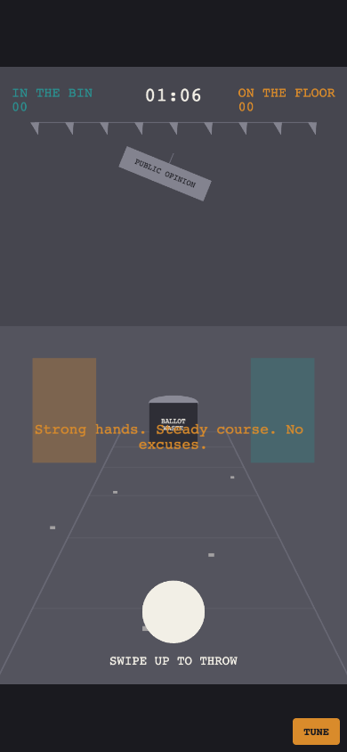

# Devlog

What happened, per stage. The engineering record.

For *what we learned about building a game with an AI partner*, see [`PROCESS-LOG.md`](PROCESS-LOG.md) — different document, different reader. Screenshots live in [`docs/progress/`](docs/progress/).

---

## Session 1 — 14 July 2026 — Design

No code. A design review of an existing concept document and three AI-generated visual direction boards, which turned out to contradict each other in four places.

**Decisions taken:** swipe-angle only (no tilt) · fictional archetypes (no real likenesses) · stylised low-poly · bin count as the sole score · Phaser + TypeScript + Vite.

**Shipped:** `CONCEPT.md` (annotated with every decision and rejection), `GDD-PROTOTYPE.md` (the build spec), `IMPLEMENTATION-PLAN.md` (Stages 0–6, two go/no-go gates), `PROCESS-LOG.md`, and the concept boards re-cast with fictional figures.

---

## Session 2 — 14 July 2026 — Stage 0: Scaffold

**PR [#1](https://github.com/PlayableStories/ballot-bin-game/pull/1) · merged**

Vite + TypeScript + Phaser 4.2, pinned to Node 24 via `.nvmrc`. Portrait-locked, `touch-action: none` so a swipe is never eaten as a page scroll. CI on every PR; every merge to `main` deploys to GitHub Pages.

The substance of this PR was **`config.ts` + `config.test.ts`**: every tunable number in one file, and the design's load-bearing claims written as *tests* before any code existed that could break them —

- the strongest legal wind stays beatable by a max counter-swipe, with margin
- …but not so beatable that the wind is decorative
- the catch window forgives depth more than lateral error
- wind half-life outlasts a throw cycle

If one of those goes red in a future tuning pass, the suite fails instead of the thesis quietly dying.

**Live:** https://playablestories.github.io/ballot-bin-game/

---

## Session 2 — 14 July 2026 — Stage 1: Grey-box

**PR [#2](https://github.com/PlayableStories/ballot-bin-game/pull/2) · merged**

The game became playable. Swipe, arc, shadow, bin, counters, timer, count screen. Grey boxes only — the stage exists to answer whether the arc reads as depth, and art would only make that answer harder to trust.

**Built:** pure systems (`Projection`, `Ballistics`, `Gesture`) with no Phaser dependency, so the invariants are provable. The **renderer seam** (`render/Renderer.ts`): game logic hands over world coordinates and never touches a sprite, so swapping grey boxes for polygons (Stage 4) or PNGs (Stage 5) is swapping one class.

### The bug that justified the whole stage

Driving the real game in a browser found what 72 passing tests could not: **the physics and the gesture mapping were each perfectly correct, and together they made the game unplayable.**

| Measured | |
| --- | --- |
| Power window that goes in | **−4% to +5.5%** |
| Power a real human swipe produces | **0.82 → 1.30** |
| Result | **4 of 5 plausible swipes missed — on power, before wind said a word** |

And the throw noise had been sized by feel, against nothing:

| Noise | Window it lives in | Damage |
| --- | --- | --- |
| ±2% power | ±5% | ate 40% of it |
| ±1.5° angle | ±0.30m lateral | moved the ball 0.14m — half of it |

Straight, correctly-judged throws were being knocked out of the bin **by dice** — and the player would have blamed **the wind**, because in this game an unexplained sideways miss *reads as politics*.

**Fix:** `POWER_EASE` 0.75 → 0.12; gesture references recalibrated so an ordinary swipe sits dead centre of the window; noise cut to cosmetic. In-browser hit rate on straight throws: **1/5 → 11/11**.

**Design consequence, accepted:** swipe *strength* is now a light touch, not a skill. Which is the game, stated mechanically — *with no political wind, every vote reaches the count; all of the difficulty is political.*

`Throw.test.ts` is new and holds the seam: gesture → ballistics, end to end, with noise, 200 iterations.

---

## 🔴 Open — the angle window is finer than a thumb

**Found by playtest, 14 July.** William, on a real phone: *"the hit rate is a bit on the difficult side."*

Measured, and the complaint is exactly right — the number is worse than it feels:

| Wind | Swipe angle that lands it | Window |
| --- | --- | --- |
| 0.0 | −3.2° to +3.2° | **6.4° wide** |
| 1.5 | −12.9° to −6.4° | 6.5° |
| 3.0 | −23.2° to −16.3° | 6.9° |
| 4.5 | −34.2° to −26.7° | 7.4° |

**With no wind at all, a straight throw survives only ±3.2° of swipe error.**

A thumb does not travel in a straight line. It pivots from a joint, so it *arcs* — and it arcs by considerably more than 3.2°. The game is not hard because the wind is hard. It is hard because **the input resolution is finer than the instrument**, and the player is being punished for anatomy.

Note also that at max wind the required window (−34.2° to −26.7°) barely fits inside the ±35° legal swipe range. There is almost no room left.

### The fix, and why it costs nothing

Halve `THROW.LATERAL_GAIN` (0.9 → 0.45) and drop `WIND.MAX` to match (4.5 → ~2.4).

Each degree of swipe then moves the ball half as far, so the angular tolerance **doubles to ±6.4°** — within what a thumb can actually do. Because the wind cap falls in proportion, *every design ratio survives untouched*: the wind is still just-beatable at max counter-steer, the catch window is still forgiving in depth and tight laterally, wind is still the only difficulty. The absolute value of `WIND.MAX` is an internal unit the player never sees.

This is a rescale of the input mapping, not a softening of the game.

### Do it before Stage 2, not after

Stage 2's entire purpose is the playtest question *"can a player read the wind from the room?"* If the baseline throw is already fighting the player's thumb, that playtest returns a **false negative** — testers will fail, and it will look exactly like *"the wind isn't readable."*

That is precisely the trap Stage 1 just escaped, one stage later and more expensive. Baseline difficulty contaminates every measurement taken on top of it.

### Update — 16 July: reviewed, parked, built on anyway

William, back on the phone: *"the difficulty is so far alright — I'll review it in detail later."* So the rescale above is **not** applied. The game still plays at ±3.2°, and Stage 2 was built on that baseline by decision.

The wind code does not depend on the number — but the go/no-go playtest does. So this is not resolved, it is *held*, with the trap above written down next to it: if five testers struggle, read it as *maybe-difficulty* before *maybe-unreadable*, or drop `LATERAL_GAIN` / `WIND.MAX` first (the Stage 3 panel does it live, in the hand). The failing humane test in `Solver.test.ts` stays red-by-design until it is.

---

## Session 3 — 15 July 2026 — Stage 3: Tuning

**PR [#4](https://github.com/PlayableStories/ballot-bin-game/pull/4) · merged**

Built *ahead* of Stage 2, on purpose: the tools to fix a bad feel should exist before the stage most likely to produce one.

A DOM-over-canvas panel — plain HTML, so it works with real thumbs on a real phone — exposes every constant in `config.ts` **live**. The config objects are mutable and every system reads through those references, so a drag lands on the very next throw with no reload. The readout at the top is the point: it reports the angular slack a thumb actually has (🔴 / 🟠 / 🟢), turning "feels hard" into degrees as you move the slider. `COPY CONFIG` emits a paste-ready diff, so a session in the hand becomes a commit.

Gated to dev hosts only — localhost and LAN IPs (the first cut missed the phone-on-LAN case, since the panel exists precisely for a device hitting `172.20.x.x`; fixed, with a test). Never shipped to players. `npm run solve` runs the same solver headless, so a later tuning tweak that broke the beatable-cap invariant would fail the suite, not the game.

---

## Session 4 — 16 July 2026 — Stage 2: Wind and speech

**PR [#5](https://github.com/PlayableStories/ballot-bin-game/pull/5)**

The stage the plan calls *"the one that decides if the game exists."* The wind stopped being a number a human dials and became something politics blows. Still grey-box — bunting is a line, leaflets are rectangles — because that is the whole point of the gate: if the wind reads from *shapes*, art is polish, and if it doesn't, art won't save it.

**Built, all pure and all tested:**

- **`systems/Wind.ts` — the wind as a state machine.** A speech sets a *target*; the wind eases toward it over 0.6s (never snaps — the room must be *seen* to change), and left alone it decays back toward calm (half-life 5.8s). The four effects, each clamped to the beatable cap: `PUSH` adds a signed magnitude, `AMPLIFY` ×1.6, `DAMPEN` ×0.45, `REVERSE` ×−0.85. **16 tests** — ramp, decay half-life, each effect, the cap, the gust.
- **`systems/Speeches.ts` + `data/speeches.json` — ten statements as data**, five per archetype, all four effects, a `REVERSE` each, kept *outside the code* so a new election is a content swap. A pure scheduler: first line at 1s, 5–8s gaps, no line twice, no candidate three times running, and the subtle one — a bias *against* speeches that would pin the wind at the cap, so the room never saturates and sits there unreadable. **10 tests**, run across 40 seeded sessions.
- **The room as the meter** (grey-box, through the renderer seam): bunting lean, drifting floor litter, slogan-words blown off the speaking podium, the swinging `PUBLIC OPINION` sign, and a podium that lights for whoever is talking. Every one is driven off the *same* number, `w = W / WIND.MAX`, so they can never disagree — one instrument seen five ways. **There is no numeric wind meter, and there never will be.**
- **One telegraphed gust per session:** 0.8s of warning (the sign rattles, `⚠ GUST` pulses), then a raised-cosine ±3.0 that is deliberately *unbeatable* — the one moment a correct read cannot save you, signposted so heavily you watch it come and can do nothing. Rare enough to sting, not to embitter.

Captions type on in the speaker's colour; the caption *is* the performance — no voice acting in the prototype.

**Verified** the Stage 1 way, because a green suite is not a running game:

- 121 unit tests green, typecheck and production build clean;
- then driven headless in a real browser — the scene renders, a ballot scored, zero runtime errors, and the shot below catches the room mid-speech: the Strong Leader talking, the sign swung and the bunting leaning under the rightward wind his words just raised.

**Not done, and not mine to finish:** the ⛔ go/no-go is the playtest — five people who are not us, reading the wind from the room alone, beating it with no meter. Until that runs, Stage 2 is *code-complete, not signed off.*

---

## Next

**Stage 4 — real rendering.** Grey boxes out, flat-shaded polygons in, still zero image files: the room, podiums, bin, hand and ballot as polygon data, real typography, the count screen and the camera pull-back over the scattered ballots. The art-path decision — code-drawn, hybrid, or production art — lands *here*, not before.

Two threads carried forward, both flagged above and both the human's to close:

- **The Stage 2 go/no-go playtest** — five strangers, no meter. Not yet run.
- **The ±3.2° difficulty rescale** — parked by decision, with the tools in place to do it live.
