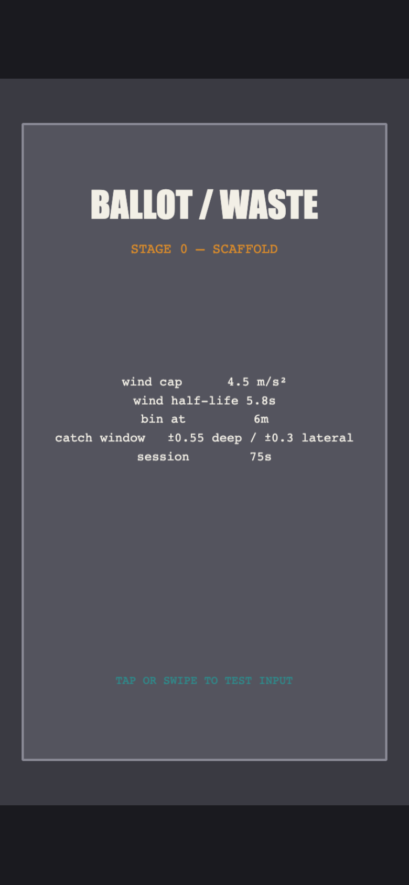
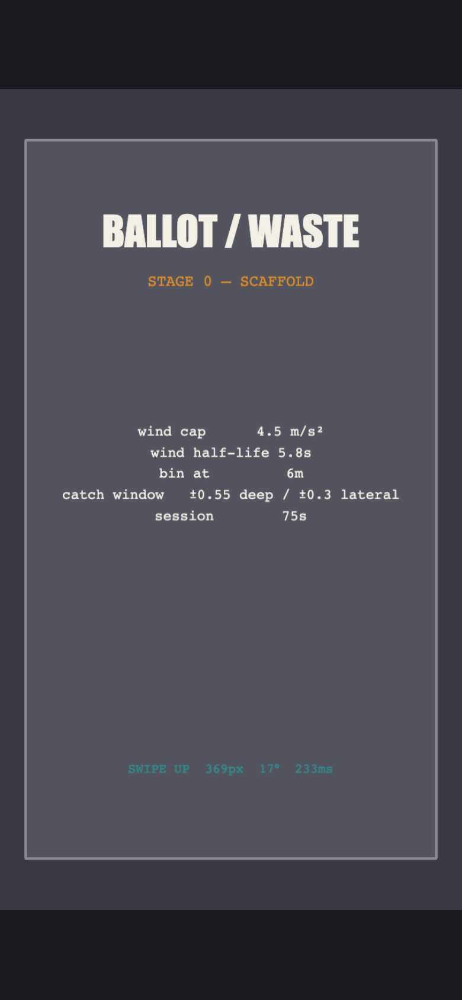
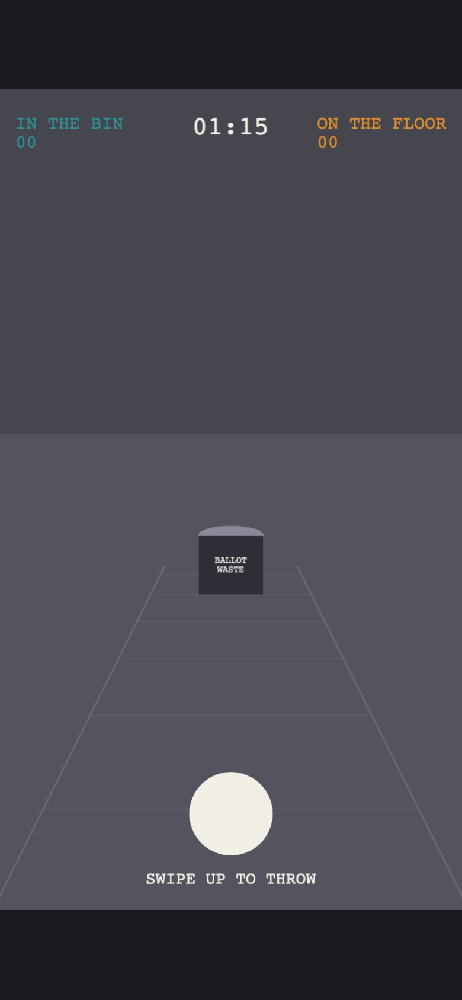
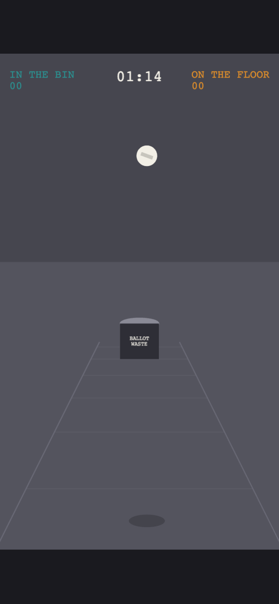
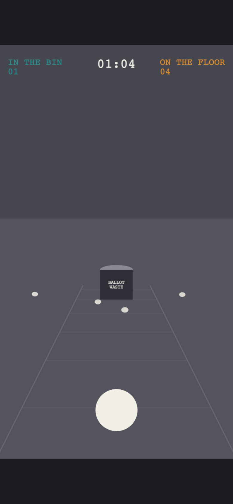
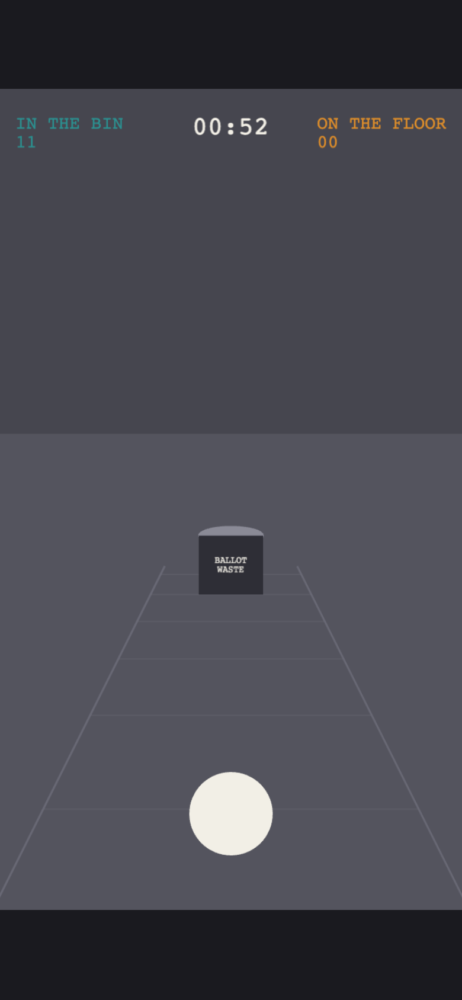
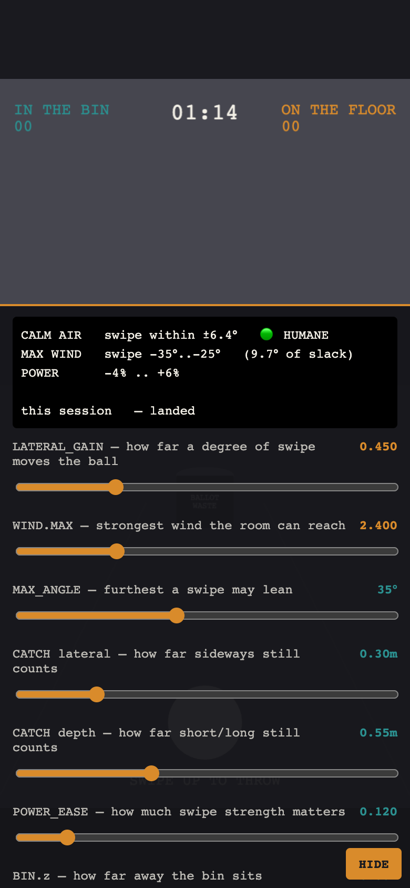
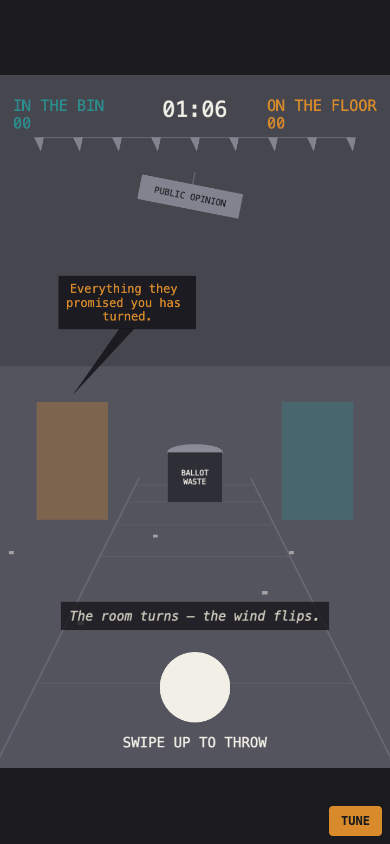

# Build progress — screenshots

One shot per stage, kept because this repo is teaching material as well as version control, and the interesting thing about a game's development is rarely the finished screen.

The story behind each of these — what broke, what the numbers were — is in [`DEVLOG.md`](../../DEVLOG.md). What we learned working this way is in [`PROCESS-LOG.md`](../../PROCESS-LOG.md).

All shots: headless Chromium, iPhone-sized portrait viewport (390×844), driven with real swipe gestures.

---

## Stage 0 — Scaffold

| | |
| --- | --- |
|  |  |

A rectangle and some text, deliberately. Its job was to prove the three things Stage 1 would depend on and could not easily debug later: portrait scaling works on a real device, touch input arrives, and the config is actually wired in rather than merely compiling — hence the design's load-bearing constants printed live from `config.ts`.

The swipe readout on the right (`369px 17° 233ms`) is the entire point of the scene. The whole game is one gesture; discovering at Stage 1 that the browser was eating it as a page scroll would have been a bad afternoon.

This scene was deleted the moment Stage 1 landed. It existed to answer a question, and it answered it.

---

## Stage 1 — Grey-box

Coloured shapes only, on purpose. Depth is bought with three cheap things: a converging lane, floor bands spaced evenly in *world* units so they bunch with distance, and a horizon.

The ball in flight, with its shadow tracking separately along the floor. **The shadow is the primary depth cue in the whole game** — without it the ball is a circle drifting on a flat picture. Not decoration.

---

## The two screenshots that mattered

| Before | After |
| --- | --- |
|  |  |
| **1 in the bin, 4 on the floor.** Three of those five were straight throws with no wind — which 72 passing tests insisted should all have landed. | **11 in the bin, 0 on the floor.** After the retune. |

The left-hand image is why the grey-box stage exists. Two perfectly correct systems, wired together, made an unplayable game — and no unit test could see it.

Full diagnosis in [`DEVLOG.md`](../../DEVLOG.md).

---

## Stage 3 — Tuning

Built before Stage 2, on purpose: the instrument that turns a bad feel into a number you can drag, in the hand that is complaining about it. Every constant in `config.ts` is live; the readout at the top reports the angular slack a thumb actually has (🔴 / 🟠 / 🟢), and `COPY CONFIG` turns a phone session into a commit. Dev hosts only — it never ships to players.

---

## Stage 2 — Wind and speech

Still grey-box, now blown by politics. This is the stage the plan calls *"the one that decides if the game exists."*

The Strong Leader is speaking (amber podium lit, caption in his colour, slogan words rising off the podium) — and the room has *leaned*: the `PUBLIC OPINION` sign has swung and the bunting tilts under the rightward wind his words just raised. **That lean is the entire wind meter. There is no numeric one, and there never will be.**

### After the first playtest — the politician actually speaks

The first plays on the live build reshaped how a speech is presented. Two things were wrong: the sentence didn't read as the politician *speaking* — it was a detached subtitle, while single words flew off the podium and looked like the real output — and there was no separate line explaining what the speech *did*.

Now the beat has **two distinct voices**. The politician says a **full sentence** in a bubble beside their podium, in their colour, tail pointing at them — *"Everything they promised you has turned."* A moment later a **comment** explains the consequence, low on a dark plate near the thumb, in plain italic — *"The room turns — the wind flips."* The old flying words stay, but demoted to faint wind-blown litter so they can't be mistaken for the speech.

Underneath, the bank grew from ten lines to thirty-two (sixteen per archetype). Both archetypes push the wind *both* ways across it, on purpose — the two campaigns are one colour each, never red-and-blue, because the wind is not a left–right seesaw; it is rhetoric accumulating. (A test enforces that.)

Whether a stranger can actually *read* the lean and beat it — with no meter — is the go/no-go playtest, and it is still ahead. Built is not signed off. Story in [`DEVLOG.md`](../../DEVLOG.md); what we learned in [`PROCESS-LOG.md`](../../PROCESS-LOG.md).
